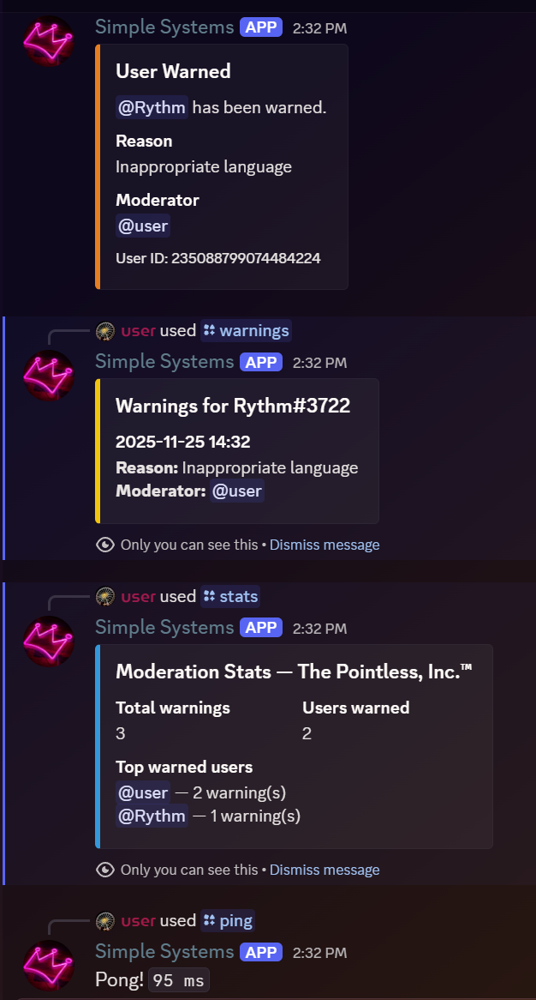

## Preview

Here’s an example of the bot’s embed outputs:

# Discord Moderation & Analytics Bot
A small Discord bot built with Python and `discord.py` that provides moderation tools and server analytics.  
The goal of the project was to keep the code clean, modular, and easy to extend in the future.

---

## Features

### 🔧 Moderation
- **/warn @user reason**  
  Adds a warning to the server database with the user, reason, moderator, and timestamp.

- **/warnings @user**  
  Shows the user's most recent warnings in the current server.

### 📊 Analytics
- **/stats**  
  Displays several useful moderation metrics:
  - Total warnings in the server  
  - Number of unique users warned  
  - Most-warned users  
  - Warnings per moderator  
  - Warnings per day (last 7 days)

### 🩺 Heartbeat Task
A background task runs every 5 minutes and logs:
- Server count  
- Estimated member count  
- Total warnings in the database  

Useful to verify the bot is alive and working as expected.

---

## Project Structure

discord-mod-bot/
├─ main.py
├─ config.py
├─ db.py
├─ commands/
│ ├─ basic.py # /ping
│ ├─ moderation.py # /warn, /warnings
│ └─ stats.py # /stats
├─ modbot.sqlite3
└─ requirements.txt

- **main.py**  
  Starts the bot, loads cogs, syncs slash commands, and runs the heartbeat task.

- **db.py**  
  Contains all SQLite database logic.  
  Handles warning creation, lookups, stats aggregation, and over-time analytics.

- **commands/**  
  Each file contains a Discord cog with slash commands grouped by purpose.

---

## Getting Started

### 1. Install dependencies
pip install -r requirements.txt

### 2. Create a `.env` file
DISCORD_BOT_TOKEN=your_bot_token_here
DISCORD_GUILD_ID=your_test_server_id # optional

### 3. Run the bot
python main.py

---

## Requirements
- Python 3.10 or later  
- `discord.py`  
- `python-dotenv`  
- SQLite (built into Python)

---

## Why SQLite?
For a small to medium-sized Discord bot, SQLite is fast, easy to maintain, and doesn’t require running an external database server.  
The schema is intentionally simple so it can be swapped for PostgreSQL or MySQL later if needed.

---

## Contributing
The project is intentionally minimal and easy to expand.  
If you'd like to add more commands, analytics, logging, or moderation tools, feel free to open a pull request.

---

## License
MIT License  
You’re free to use this project for your own bots or modify it however you like.
